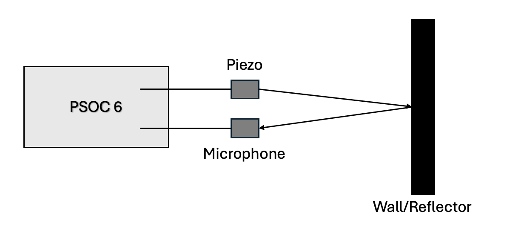

# Prototype for Blood Pressure Measuring
This prototype was created in the context of the Telekom MMS Health Hackathon for the estimation of blood pressure by using high frequency acoustic signals.

## Motivation
Blood pressure measurements once needed the daily use of cuffs. In the last decades smarter devices have emerged on the market that measure the blood pressure by utilizing light to track changes in the blood volume, a so called Photoplethysmogram (PPG). This approach is quicker but more susceptible to error and requires monthly calibration so a need for a better methodology arises.

Blood pressure measurements can be done with high frequency sound to calculate the thickness of the arteries and blood volume. With this method the calibration needs to be done only once a year. 

The actual measurements in tissue require a higher frequency of sound in the MHz range. This isn't feasible with our current equipment that operates in the kHz range. The idea is to develop a prototype that is capable of distance measurements in air using a microphone and a piezo element for sound emissions.

## Idea
To calculate the distance to the wall, we utilize Time of Flight (ToF) measurements. This can be done by emitting a signal at a certain frequency (41.6 kHz) and listening for the reflection of said frequency with the microphone. Knowing the point of sending we can then infer the ToF for the signal to the wall and back, divide it by 2 and combine it with the speed of sound (approx. 343 m/s) to get an accurate distance to the wall. 

## Hardware
For our prototype we have a PSoC 6 AI from Infineon. The PSoC possesses a microphone for sampling up to 96 kHz. For our sound emission a piezo element is used, that is controlled by 2 GPIO pins.

The PSoC 6 AI has a built-in Digital Signal Processor (DSP) that can take over most of the floating point signal processing tasks (FFT, IFFT, Convolution).

## Software
The PSoC runs with a C program that can be flashed on the chip with Infineon's ModusToolbox. The PSoC has 2 cores: CM0P with a lower frequency and the CM4 with a higher frequency. The former runs the code that is responsible for sending the signal and the latter for processing the incoming signal captured by the microphone. The two cores can communicate with Interprocess Communication (IPC).

## Functionality
### Sound Emission
Sending the 41.6 kHz is rather simple but is done in 5 bursts to facilitate later steps. The GPIO's are turned to high and low at a fixed interval to generate such a signal. This is done on the slower CM0P core.

The other core is informed to start listening after we send our signal with an IPC call.

### Signal Processing
The actual computationally heavy task is processing the incoming signal, filtering it and turning it into a form that allows ToF measurements. This is done on the faster CM4 core.

#### Raw Signal
First of all, the signal is captured by the microphone at a frequency of 96 kHz. For the extraction of the data into the program 1024 samples are taken at once from the microphone. With the 96 kHz that equates to a total capture time $t_\text{Capture}$ for 1024 samples

$$
t_{\text{Capture}} = \frac{\text{Sample Count}}{\text{Sample Rate}} = \frac{1024}{96000 Hz} \approx 11 ms.
$$

The Infineon PSoC library provides a `cyhal_pdm_pcm_read_async` function to read audio samples from the microphone data buffer. Due to its async nature, a busy wait is performed that waits for a flag being set by an Interrupt Service Routine (ISR) when 1024 samples have been accumulated.

#### Fast Fourier Transformation
The FFT is applied to turn the raw audio signal into the frequency domain. This gives us an array of amplitudes and phases, where each amplitude and phase correspond to one frequency in the raw signal.

The FFT can be done with the ARM CMSIS DSP library function called `arm_rfft_fast_f32`.

#### Band Pass Filter
The Band Pass Filter is applied to filter all unwanted frequency that are not within a bandwidth around our desired sent frequency (41.6 kHz).

The band pass filter is done in a function `filter_fft` written by us, that simply sets all unwanted frequencies to 0. Most importantly, it takes the bandwidth as an argument.

#### Inverse FFT
With the signal now split up into frequencies and filtered we can apply the Inverse FFT (IFFT) to convert the signal back into the time domain. This allows us to get timing information for ToF calculation.

The inverse FFT is done with the same `arm_rfft_fast_f32` function. A flag is set that indicates inverse operation.

#### Generate Signal
To perform a convolution in the next step, we need to generate a signal that matches the one we sent. We then expect to see this signal in the inverse FFT output.

The generation process of our signal is easily done as we know the sample rate and the sent frequency and can calculate the samples. We get

$$
\text{Sample Count} = \frac{f_{\text{sample}}}{f_\text{sent}} \times \text{Burst Count}
$$

The value of the samples must be either High (1) or Low (0) as our emitted signal represents a rectangular function. For the values in our signal it is that

$$
\text{Signal}[i] = \left\lfloor i \times \frac{f_{\text{sent}}}{f_\text{sample}} \times 2 + 1 \right\rfloor \mod 2
$$

with $i \in [0, \text{Sample Count} - 1]$. The $+1$ is added to account for the fact that our signal starts with High (1).

All this is done in our function `generate_sent_signal`.

#### Convolution
A convolution is used to highlight the exact position of the sent signal in the time domain. The sent signal is known (5 bursts of High/Low) and is convoluted with the IFFT signal. This gives us a spike at the reception of the reflected signal.

The 5 burst pattern makes convoluting the signal less error prone as false positives are ruled out.

The convolution can be done with `arm_conv_partial_f32`. It takes the signal that we sent, which we generated earlier.

#### Time of Flight / Distance Measurements
The Time of Flight can be estimated by looking at the amount of samples that were received until the convolutional peak was observed. The reflection of the signal is guaranteed to be in the 1024 samples of the audio buffer. This can be shown with the capture time $t_{\text{Capture}}$ derived earlier and calculating the maximum distance sound can travel in this time

$$
\text{Max Distance} = \text{Speed of Sound} \times t_{\text{Capture}} = 343 m/s \times 11 ms = 3.7 m.
$$

For measurements below 3.5 meters the sent signal is guaranteed to be inside the 1024 audio samples (Note: the effective distance that can be measured with our method is way below this value because of scatter).

The sample that contains the peak in the convolution is the one that can be used for time calculation. This give us

$$
\text{ToF} = \frac{\text{Sample Number}}{\text{96000 Hz}}.
$$

ToF is the round trip time for the signal. So for the distance measurements we are required to divide it by 2.
Therefore,

$$
\text{Distance} = \frac{\text{ToF} \times \text{Speed of Sound}}{2}.
$$

The actual distance contains a small but fixed offset that needs to be subtracted to get an accurate distance measurement.

### Output
The results from the signal processing are sent via serial (UART) to the host device.

### Visualization
There is a python script available that captures the serial data and plots corresponding graphs. TODO: more stuff here

## How to get it running
The setup is best tested on Windows and requires the ModusToolbox form Infineon. Our program can be flashed onto the PSoC by using the `make program` command. The piezo element needs to be connected to GPIO `0` and `1`.

For a visual representation of the incoming data a python script can be launched.

The piezo element should be close to the microphone.

